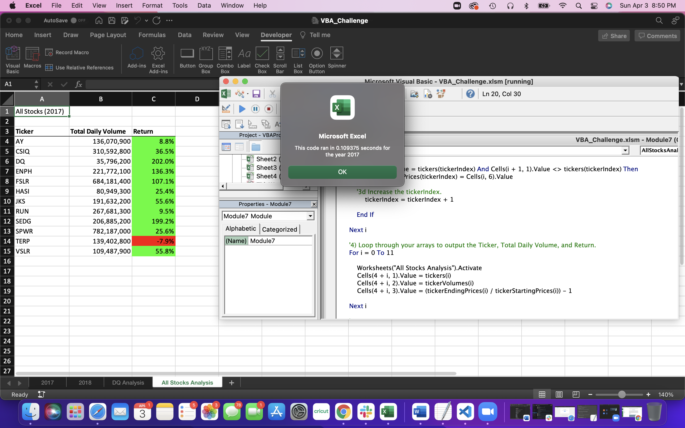
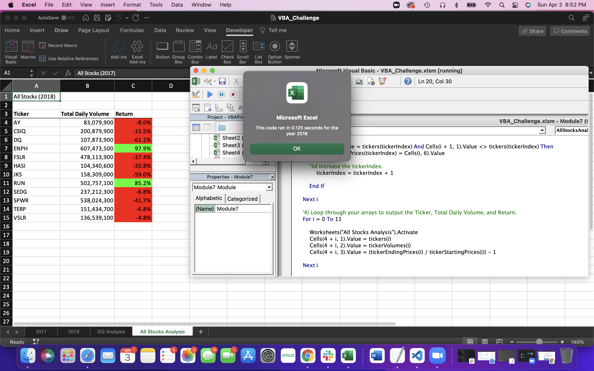

# VBA of Wall Street – Stock Analysis

## Overview of Project

### Purpose
The purpose of this project is to provide insight into the performance of stocks over two years. The client is interested in the “DQ” stock and wants to see if the stock would be a good fit for their portfolio based on the performance. Given the size of the data and the macros we ran, the data had to be refactored so it could perform the analysis efficiently.

## Results
The data set used for this analysis encompasses the trading data for 12 stocks over the course of 2017 and 2018. The data analyzed was the total daily volume of stocks traded and the return percentages based on the starting and ending prices of the stocks. The data shows that all but one stock had positive returns in 2017 but only two stocks continued to have positive returns in 2018. One of those stocks, “ENPH,” had a lower return percentage in 2018 than in 2017 while the ”RUN” stock had a higher positive return in 2018 than in 2017. After refactoring the data, the macro took less than .2 seconds to return the results whereas before the refactoring it took about .75 seconds. 

## Summary
I think refactoring code has both advantages and disadvantages. From this exercise, it is clear that refactoring the code greatly cuts down processing time of the data. I believe that the disadvantages are dependent on the size of the data set. For this exercise, the data set was 3012 rows per worksheet. Given that the time saved when running the macro before and after refactoring was less than half a second, I do not think the time spent refactoring the code outweighs the time saved when running the module. Of course, if you plan on continuously adding data, then it will be beneficial long term. For this exercise, refactoring the code was more of a con than a pro. Prior to refactoring, the code I wrote came back with the exact same results as after refactoring. While refactoring the code, it took a significant amount of time to figure out why I kept getting a bug error. It came down to indentation. I think that depending on the data set, if you were to receive someone else’s code to refactor, it is possible that you could come across bugs that would be difficult to solve and would be more time consuming to troubleshoot than to run the module as is. 

